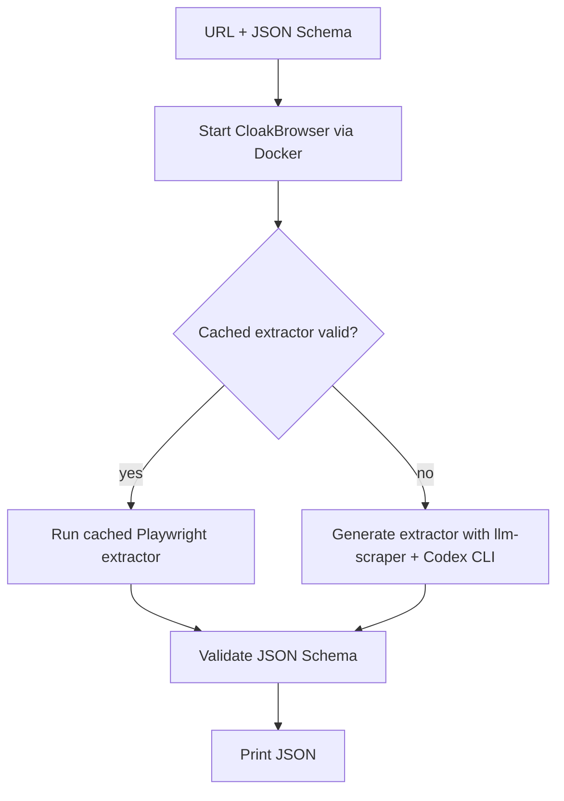

<p align="right">
  
</p>

# yo url yo json

*URL + Schema -> JSON*

`yo-url-yo-json` is a Bun + TypeScript CLI for extracting validated JSON from a webpage using [llm-scraper](https://github.com/mishushakov/llm-scraper), [CloakBrowser](https://github.com/CloakHQ/CloakBrowser), and [ai-sdk-provider-codex-cli](https://github.com/ben-vargas/ai-sdk-provider-codex-cli).

## Install

- Bun
- Docker
- Codex auth: `codex login` or `OPENAI_API_KEY`
- Project deps: `bun install`

## Agent Skill

Project-local skill: `skills/yo-url-yo-json/SKILL.md`.

## Usage

Generate a JSON Schema with Codex:

```bash
bun commands/generate-schema.ts --out ./schemas/product.schema.json
```

Parse a page with Codex-powered extraction:

```bash
bun commands/parse.ts --url "https://example.com" --schema ./schemas/product.schema.json
```

Useful options for `bun commands/parse.ts`:

```bash
--cache-dir .yo-url-yo-json/scripts
--model gpt-5.5
--force-regenerate
--headed
--verbose
```

Stdout is parsed JSON. Diagnostics go to stderr.

## Runtime Flow



Generated extractors are saved under `.yo-url-yo-json/scripts/`.

## Schemas

The project uses [JSON Schema](https://json-schema.org/). Schema paths must end in `.json`.

## CloakBrowser Docker Runtime

We use CloakBrowser via Docker.

Useful commands:

```bash
bun run docker:pull
bun run docker:cleanup
bun commands/parse.ts --url "https://example.com" --schema ./examples/product.schema.json
```

## Development

```bash
bun run typecheck
bun test
```
